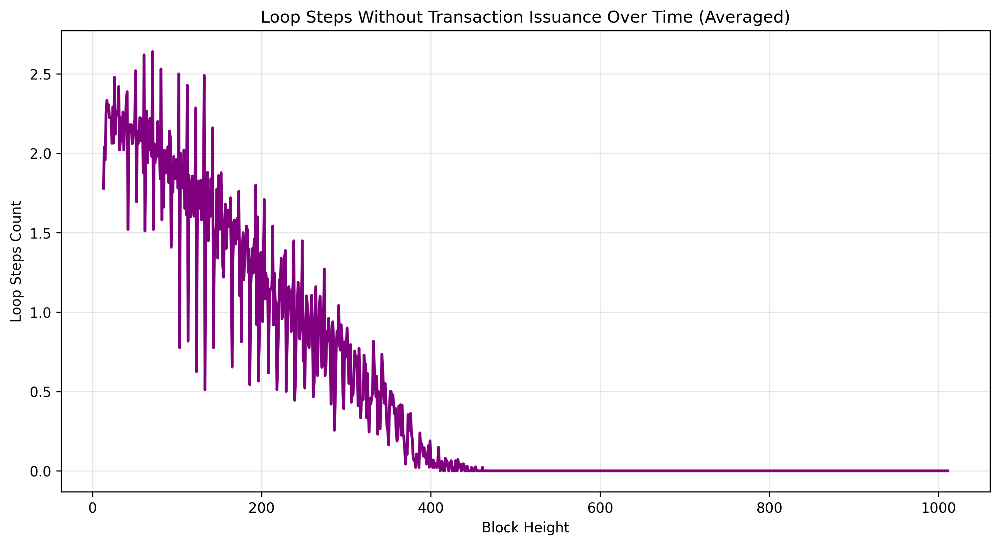
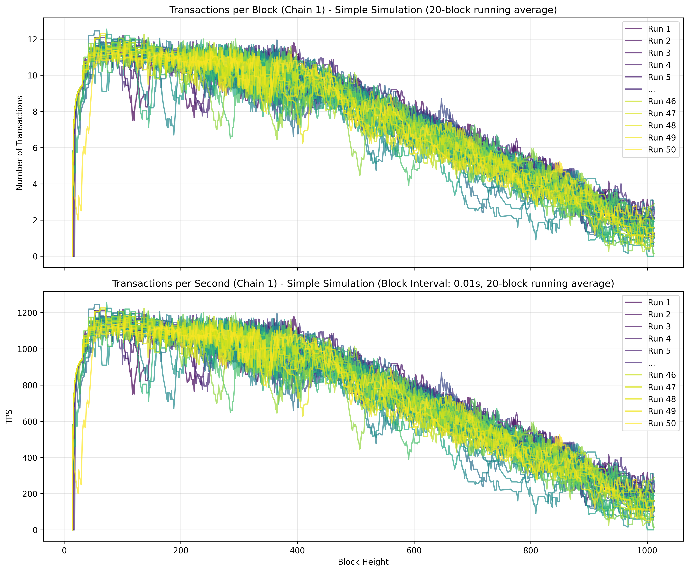
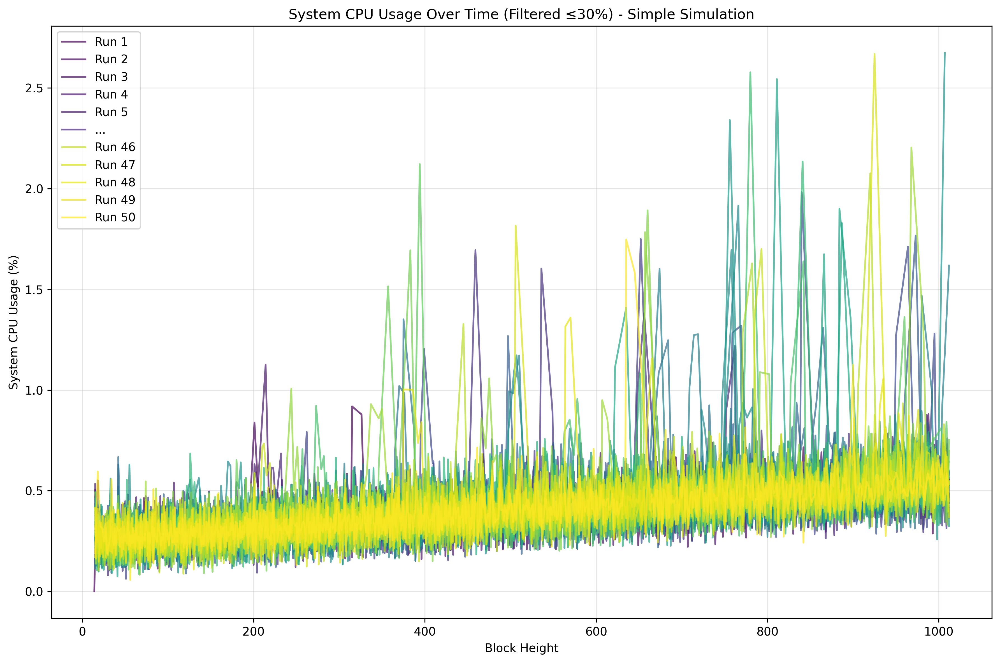
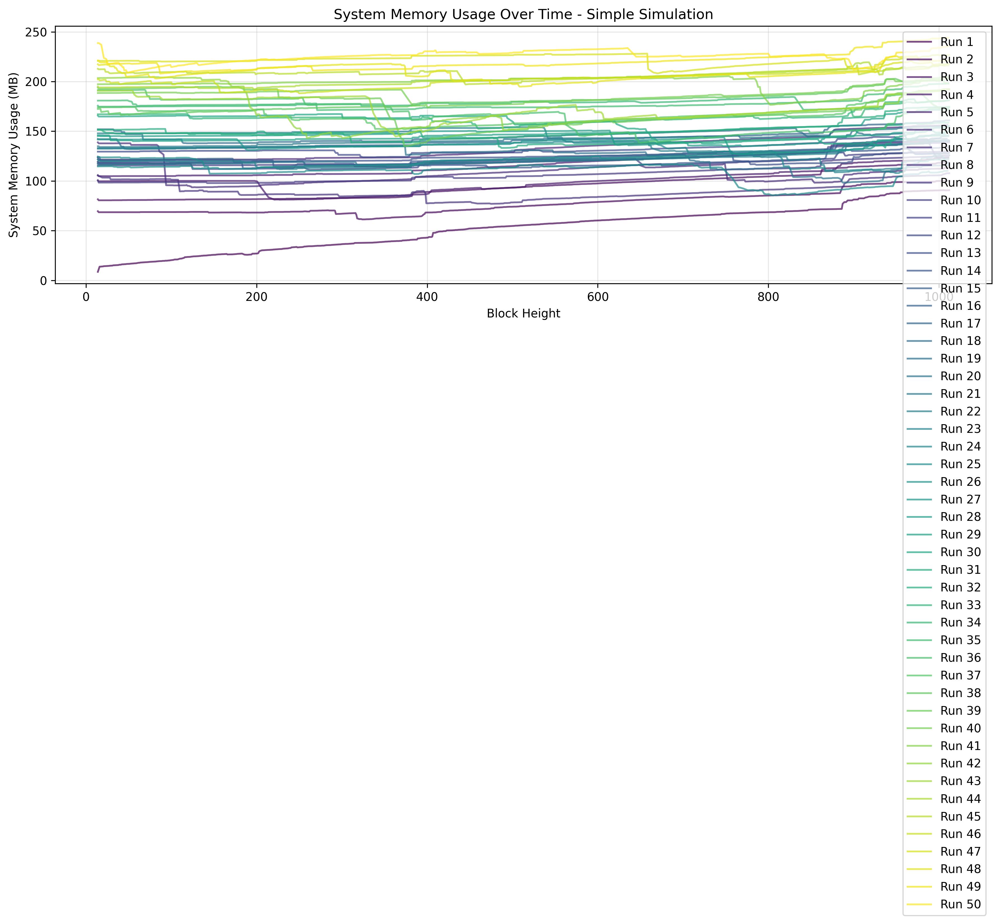
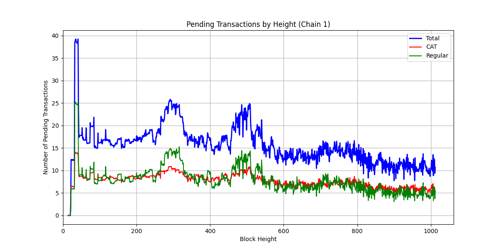
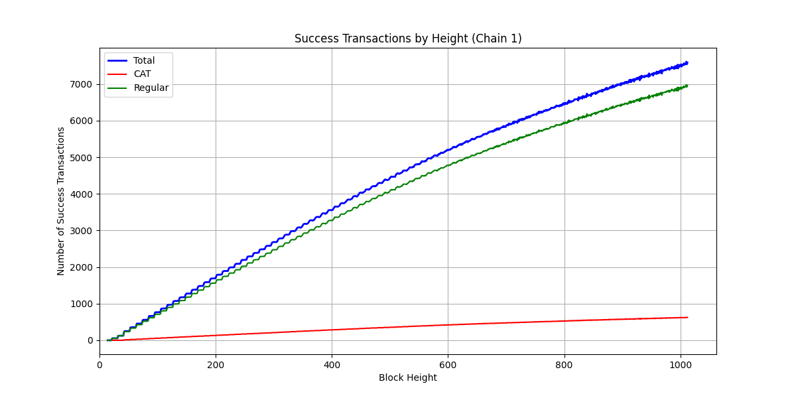
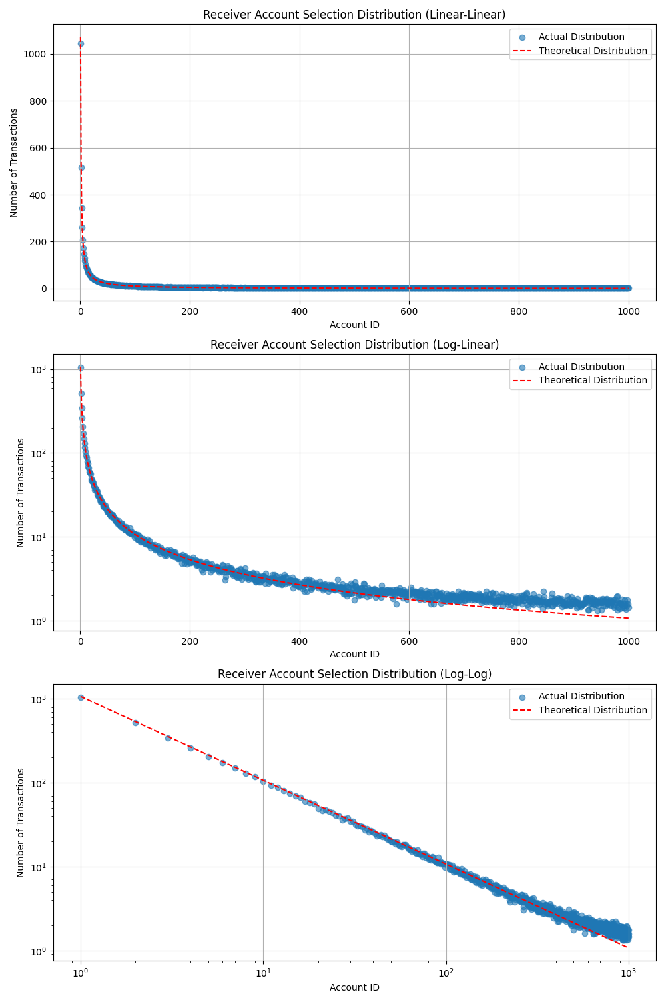
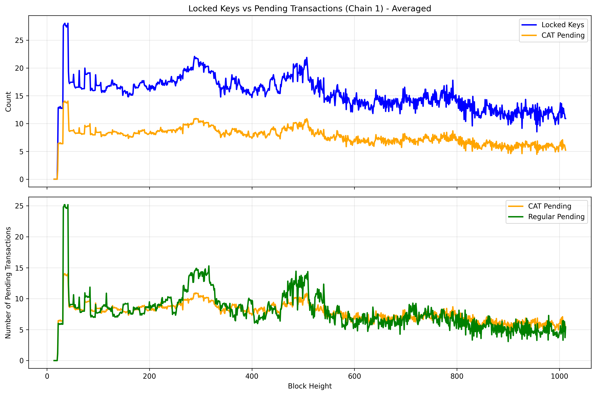

# Simple Simulation

This scenario runs the simple simulation multiple times and averages the results to provide more statistically reliable data.

## Key Features

- Single simulation run with multiple iterations for averaging
- Baseline performance measurement for system validation
- Statistical reliability through multiple runs

## Results

#### Simulation Validity Metrics

It's crucial to monitor several key metrics to ensure simulation validity and identify when the system can no longer maintain the target tps (and thus provides incorrect results).

**Loop Steps Without Transaction Issuance**: This metric tracks how many times the simulation enters a waiting loop before sending transaction batches. As the simulation progresses, if result recording takes an increasing amount of time, this number decreases. Once it reaches zero, the simulation is unable to keep up with the transaction issuance rate, indicating the simulation has failed.

**TPS (Transactions Per Second)**: Monitors the actual transaction throughput achieved by the system. Once the previous metric reaches zero, the TPS can now longer be sustained.

We can see that the individual runs are pretty consistent, thus making the average a good estimate of the system performance.

**System CPU Usage (Filtered)**: Tracks CPU utilization with spikes above 30% filtered out to show baseline system load. High or increasing CPU usage may indicate system stress.

**System Memory Usage**: Monitors memory consumption during simulation. Excessive memory growth can indicate resource leaks or system overload.

From the memory usage plot we can see that the memory increases over time, but the increase is small compared to the total memory usage.

#### Simulation Degradation

When the simulation can no longer maintain the target TPS, it provides incorrect results. This is evident in the transaction count plots below, where the simulation shows incorrect results once tps degrades.

#### Other plots

**Account Selection**: The account selection distribution displays the distribution of receiver accounts selected for transactions, which follows a Zipf distribution.

**Locked Keys**: The locked keys plot shows the number of locked keys over time. With the current simulation transactions, the CATs and the locked keys are related by a factor of 2.

**Figure Parameters:** Block interval=0.01s, TPS=1000.0, 2 chains (delay of second chain 5 blocks), 10% CAT ratio, CAT lifetime=1000 blocks, 1000 accounts, 20 runs averaged.
