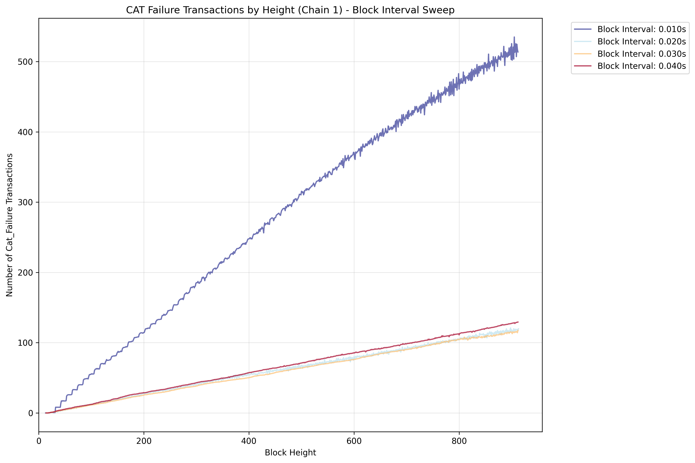

# Block Interval (All Scaled) Sweep

This simulation scales the TPS inversely with the block interval to maintain a constant number of transactions per block. This approach allows to check if running the simulation with different time intervals (e.g. 0.01s vs 1s) will result in the same simulation results. Results are expected to degrade as the block interval gets too small.

## Key Features

- Sweeps block intervals with configurable step size
- Scales TPS inversely with block interval: scaled_tps = reference_tps / block_interval
- Maintains constant transactions per block across all simulations
- Tests system consistency across different time scales

## Results

The results are expected to degrade as the block interval gets too small. For example in the below simulation, the block interval of 0.01s is a bad choice. We can also note that there appear to be steps visible in the plot for the block interval of 0.01s, which indicates that the hardware was not able to handle the simulation.

**Figure Parameters:** Block interval sweep (0.01-0.06s), reference TPS at 1s blocks=10.0, 2 chains (delay of second chain 5 blocks), 10% CAT ratio, CAT lifetime=10 blocks, 1000 accounts, 30 runs averaged.
