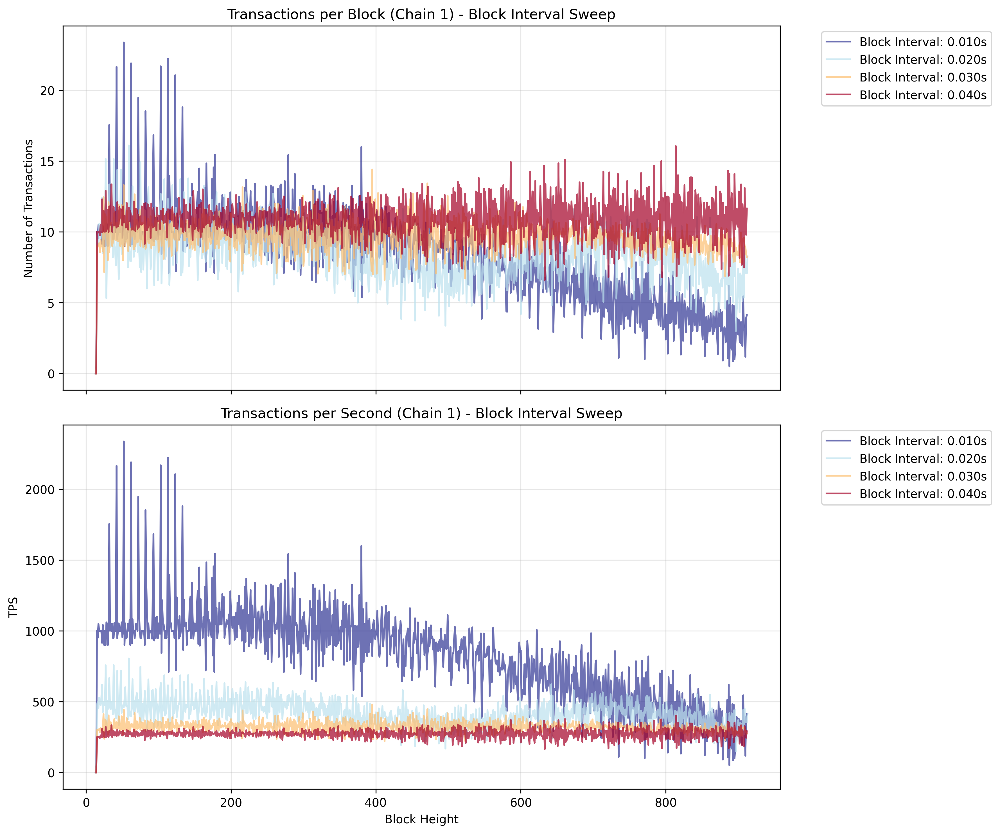
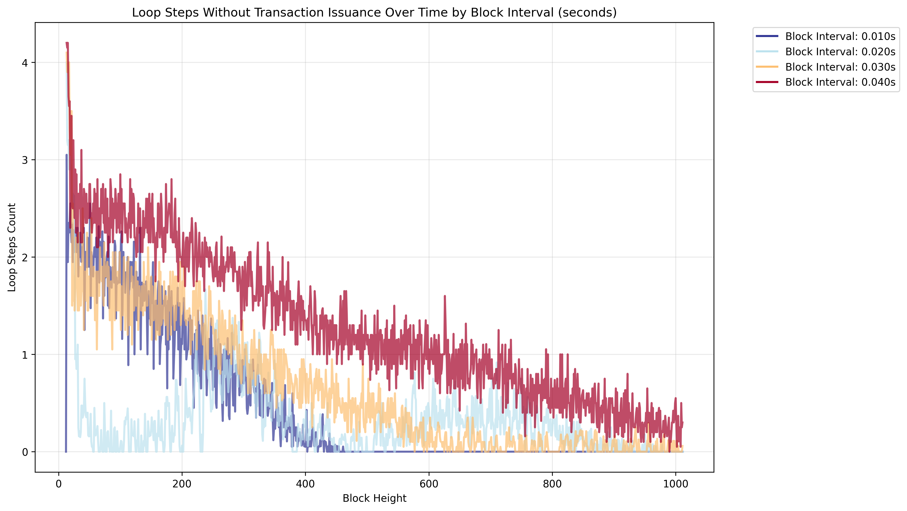

# Block Interval (All Scaled) Sweep

This simulation scales the TPS inversely with the block interval to maintain a constant number of transactions per block. This approach allows to check if running the simulation with different time intervals (e.g. 0.01s vs 1s) will result in the same simulation results. Results are expected to degrade as the block interval gets too small.

## Key Features

- Sweeps block intervals with configurable step size
- Scales TPS inversely with block interval: scaled_tps = reference_tps / block_interval
- Maintains constant transactions per block across all simulations
- Tests system consistency across different time scales

## Results

The results are expected to degrade as the block interval gets too small. For example in the below simulation, the block interval of 0.01s is not a good choice.

The reason, why the simulation for low block interval (0.01s) performs poorly, is that the tps cannot be maintained. We can see this in the plot below, where we can see that the block interval of 0.01s is not able to keep up with the transaction issuance rate.

We can further track this down by looking at the loop steps without transaction issuance. We can see that the number of times the waiting loop before sending the transaction batch is entered, decreases with the block height. This indicates that the result recording takes an increasing amount of time. Once the steps per block hits zero, the simulation is unable to keep up with the transaction issuance rate. This is also true for the other cases, although less pronounced.

> *Note:* Until resolved, we should not run too many blocks in total.

**Figure Parameters:** Block interval sweep (0.01-0.06s), reference TPS at 1s blocks=10.0, 2 chains (delay of second chain 5 blocks), 10% CAT ratio, CAT lifetime=10 blocks, 1000 accounts, 30 runs averaged.
