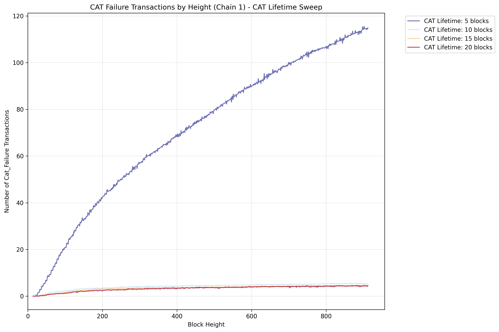

# CAT Lifetime Sweep

Explores how different Cross-Chain Atomic Transaction (CAT) lifetimes affect system performance.

## Key Features

- Sweeps CAT lifetime in blocks with configurable step size
- CAT lifetime determines how long cross-chain transactions remain valid
- Tests impact on success rates and retry patterns
- Explores transaction expiration effects on throughput

## Results

This scenario illustrates the two types of failures that can occur with CATs:

The number of failed CATs increases substantially if the CAT lifetime is too short. When the CAT lifetime is in the range of the delay of one of the chains (here 5 blocks), the number of failed CATs increases significantly as CATs are rejected due to timeouts.

On the other hand if the CAT lifetime is above the delay of the chains (here 5 blocks), the number of failed CATs is the same for the different parameter sets. This is because the failed CATs are all rejected due to locked keys.

**Figure Parameters:** CAT lifetime sweep (5-20 blocks), block interval=0.02s, TPS=500.0, 2 chains (delay of second chain 5 blocks), 3% CAT ratio, 1000 accounts, 20 runs averaged.
