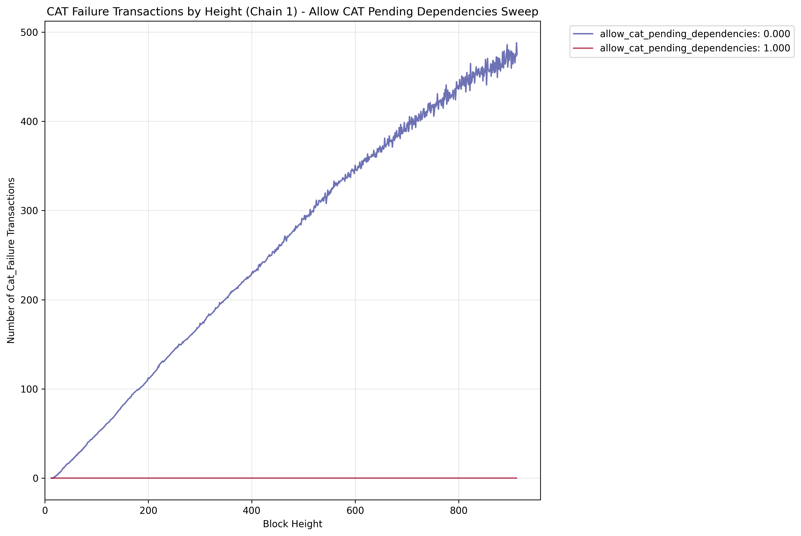
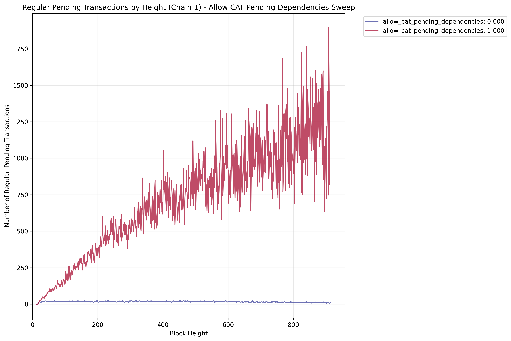
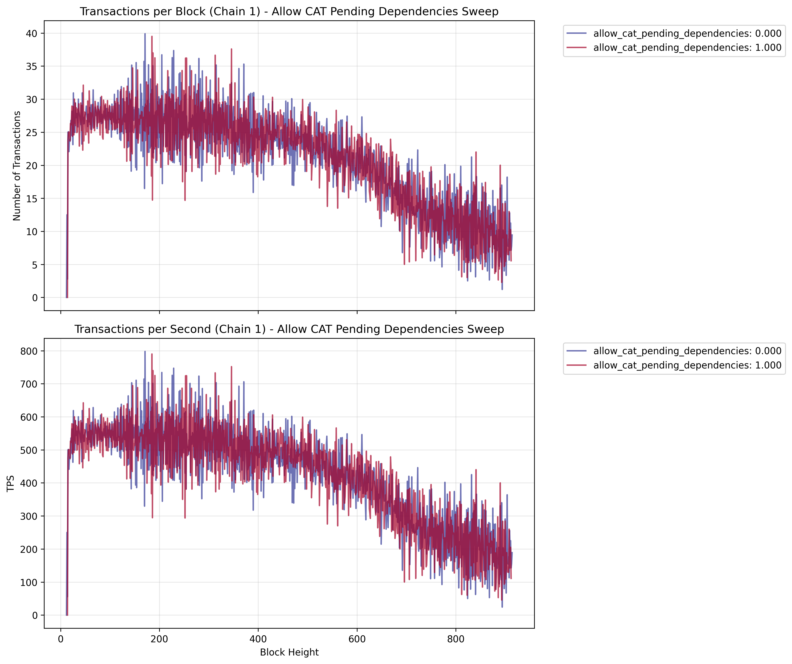

# CAT Pending Dependencies Sweep

Explores how the ALLOW_CAT_PENDING_DEPENDENCIES flag affects system performance.
It tests exactly two values to understand the impact of CAT transaction restrictions on locked keys:

- false: CATs are rejected when they depend on locked keys
- true: CATs are allowed to depend on locked keys (current behavior)

## Key Features

- Tests exactly 2 values (false/true) for the flag
- Controls whether CAT transactions can depend on locked keys

## Results

We can see that the CAT failures are much higher for the case where we do not allow dependencies (`allow_cat_pending_dependencies = false`). In contrast for the case where we do allow dependencies, CATs can only fail due to exceeding the CAT lifetime. 

The number of pending regular transactions is insignificant, when dependencies are restricted, suggesting reduced contention in the system. In contrast, when dependencies are allowed, the number of pending regular transactions is continuously increasing, as CATs are queued up (i.e. are pending) before the regular transactions.

Finally, the simulation is becoming unstable as the number of pending regular transactions becomes too high. In particular, the TPS drops significantly.

**Figure Parameters:** CAT pending dependencies sweep (false/true), block interval=0.05s, TPS=500.0, 2 chains (delay of second chain 5 blocks), 10% CAT ratio, CAT lifetime=1000 blocks, 1000 accounts, 20 runs averaged.
