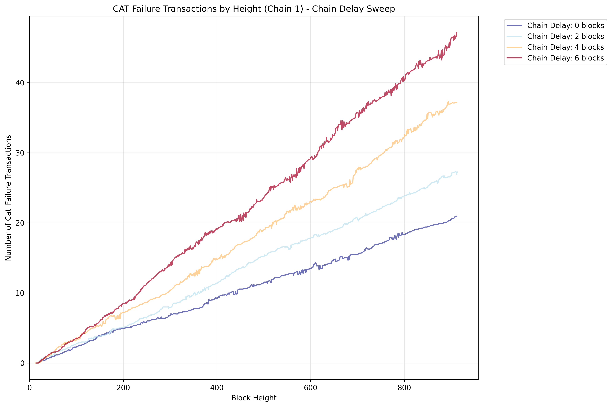
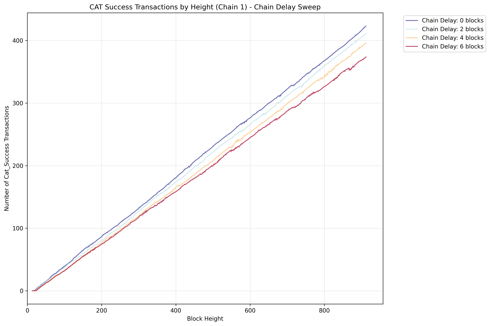

# Chain Delay Sweep

Explores how HIG delay to HS affects system performance. Varies the delay of the second chain (HIG to HS) from 0 blocks to longer periods.

## Key Features

- Sweeps chain delays from 0 blocks with configurable step size
- Tests HIG to HS communication timing effects

## Results

The delay between HIG and HS affects CAT transaction failures. As the chain delay increases, we observe increased CAT transaction failures as many of the CATs are rejected due to other CATs blocking certain keys.

The number of successful CAT transactions remains high, as long as chain delay does not exceed the CAT lifetime.

**Figure Parameters:** Chain delay sweep (0-6 blocks), block interval=0.05s, TPS=100.0, 2 chains, 10% CAT ratio, CAT lifetime=10 blocks, 1000 accounts, 20 runs averaged.
