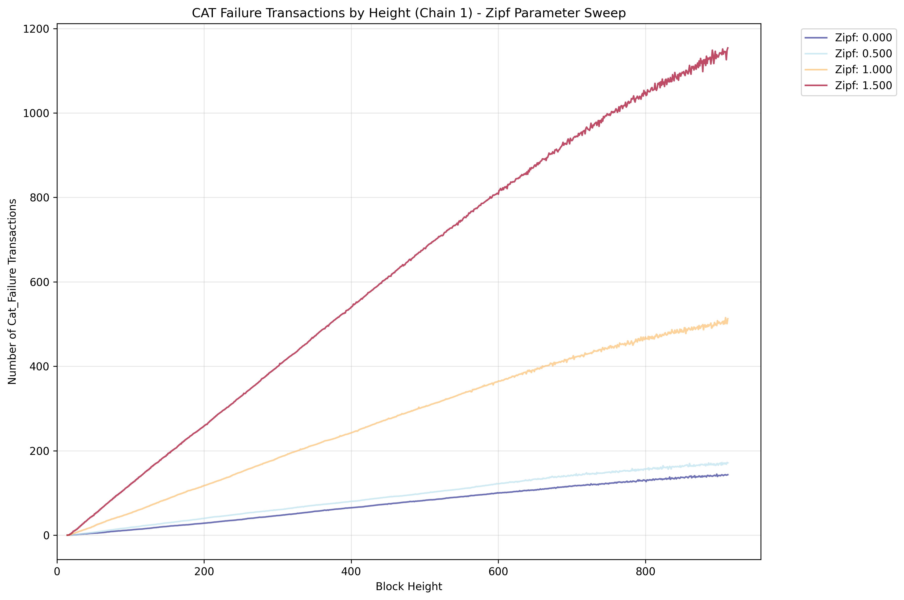
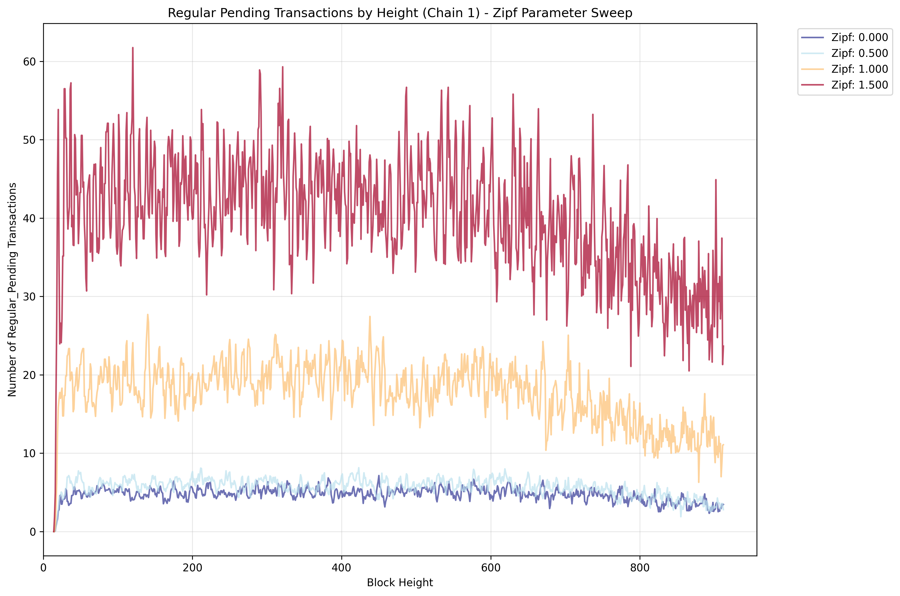

# Zipf Distribution Sweep

The receiver of the transaction is selected based on a Zipf distribution.

This scenario explores how different Zipf distribution parameters affect system performance. Varies the Zipf parameter (α) from 0.0 (uniform distribution) to higher values.

## Key Features

- Sweeps Zipf parameter from 0.0 with configurable step size
- Models access patterns where some accounts are accessed more frequently
- Tests impact of access pattern skewness on system performance

## Results

Unsurprisingly, higher Zipf values (more concentration) lead to increased failure of CATs.

A higher Zipf value also leads to increased pending regular transactions.

Finally, the simulation degrades and TPS cannot be maintained after a certain block number currently. Thus simulation results must be taken with a grain of salt.

**Figure Parameters:** Zipf parameter sweep (0.0-2.0), block interval=0.05s, TPS=500.0, 2 chains (delay of second chain 5 blocks), 10% CAT ratio, 1000 accounts, 20 runs averaged.
